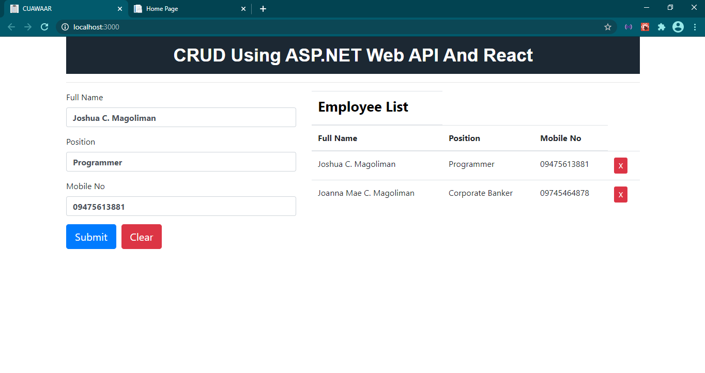

# CRUD USING ASP.NET WEB API AND REACT

* Purpose: My Project
* Used IDE: MS Visual Studio 2019
* Target Framework: .Net Framework 4.7.2
* Web Application Framework: ASP.NET
* ASP.NET Site: ASP.NET MVC
* ASP.NET Service: ASP.NET Web API
* Front End: HTML5, CSS3, Bootstrap, jQuery, React-Toastify, React
* Back End: C#, Entity Framework 6.0.0, MS SQL Server 2017
* Responsive Web Design: Yes
* Type of Website: Dynamic

<h2> User Interface Screenshots </h2> 
  
    
  
	